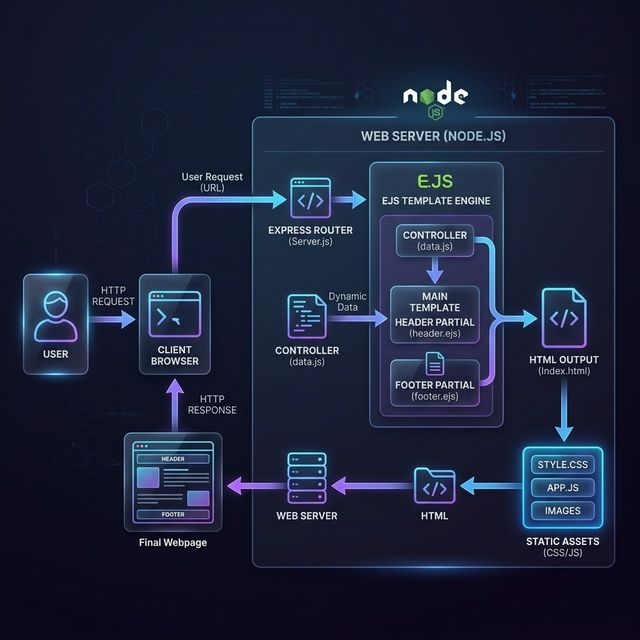
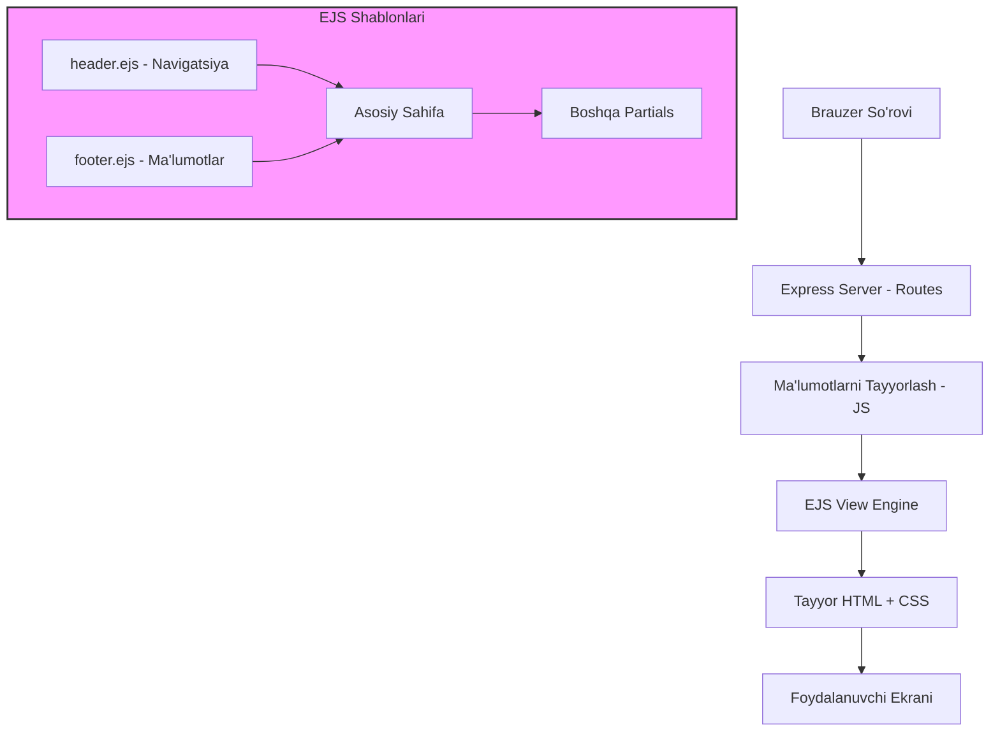

# Frontend Arxitekturasi (EJS Stack)

Siz yuborgan rasm React arxitekturasi uchun edi. Sizning saytingiz **SSR (Server-Side Rendering)** texnologiyasiga asoslangan. Quyida sizning loyihangizning frontend tuzilishi tushuntirilgan.

## Visual Frontend Arxitekturasi

## 1. Frontend Tuzilishi Diagrammasi

## 2. Asosiy Komponentlar (EJS Partials)

Sizning saytingizda React komponentlari o'rniga **Partials** (bo'laklar) ishlatiladi. Bu takrorlanuvchi kodlarni kamaytiradi:

*   **header.ejs:** Logotip, qidiruv paneli va navigatsiya tugmalari.
*   **footer.ejs:** Saytning pastki qismi va bog'lanish ma'lumotlari.
*   **chatbot.ejs:** AI yordamchi interfeysi.

## 3. Dizayn Tizimi (CSS)

Barcha dizayn sozlamalari `public/css/style.css` faylida markazlashgan:
*   **--primary-color:** Asosiy ko'k rang.
*   **--accent-color:** Och ko'k urg'u rangi.
*   **Responsive Mix:** Media queries yordamida mobil va desktop uchun avtomatik moslashish.

## 4. React va EJS farqi

| Xususiyat | React (Siz yuborgan rasm) | EJS (Sizning saytingiz) |
| :--- | :--- | :--- |
| **Render** | Brauzerda (Client-side) | Serverda (Server-side) |
| **Tezlik** | Sahifa yuklangandan so'ng tez | Birinchi yuklanish juda tez |
| **SEO** | Qo'shimcha sozlash kerak | Juda a'lo (Tayyor HTML) |
| **Tuzilishi** | JSX Komponentlar | EJS Shablonlar |
